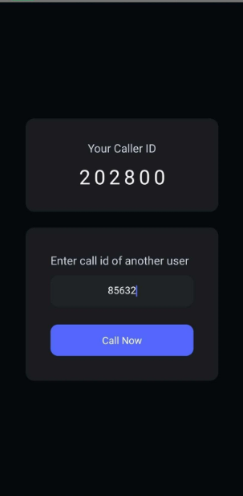

#  React Native WebRTC Video Call App

A real-time **Peer-to-Peer (P2P) Video Calling Application** built using:

- React Native  
- WebRTC  
- Socket.io (Signaling Server)  
- Node.js Backend  

This app allows two Android devices to connect using a unique Caller ID and stream live video/audio directly between them.

---

#  How It Works (Beginner Friendly Explanation)

This app uses **WebRTC (Web Real-Time Communication)**.

### Step 1 — Signaling (Finding Each Other)
A Socket.io server helps two phones discover each other.

### Step 2 — Offer & Answer
- Caller sends an **Offer**
- Receiver sends back an **Answer**

### Step 3 — ICE Candidates
Both phones exchange network information (ICE Candidates) to find the best path.

### Step 4 — Direct P2P Streaming
After handshake:
-  Video travels directly phone-to-phone  
-  No video goes through the server  
-  Ultra low latency  

---

# 🖼 App UI Preview

Images are located inside:

```
src/assets/
```

| Feature | Preview |
|---------|----------|
| Caller Screen |  |
| Incoming Call |  |
| Hangup Button |  |

---

# 📦 Project Structure

```
root
 ├── server/        → Node.js + Socket.io signaling server
 ├── src/
 │    ├── assets/   → Images
 │    └── components/
 ├── android/
 ├── App.jsx
 └── .env
```

---

# 🛠 Requirements

- ✅ Physical Android device (WebRTC unstable on emulator)
- ✅ Node.js installed
- ✅ Android Studio configured
- ✅ Same WiFi network for both devices

---

# 🔧 Setup Instructions


## 2️⃣ Install Dependencies

### Install frontend dependencies:

```bash
npm install
```

### Install server dependencies:

```bash
cd server
npm install
cd ..
```

---

## 3️⃣ Setup Environment Variable

Create a `.env` file in the root folder:

```
API_URL=http://YOUR_LOCAL_IP:3000
```

Example:

```
API_URL=http://192.168.100.177:3000
```

⚠️ Use your laptop's local IP address.

---

## 4️⃣ Start Signaling Server

Inside `/server` folder:

```bash
node index.js
```

Server runs on:

```
http://localhost:3000
```

---

## 5️⃣ Start Metro

From root folder:

```bash
npm start
```

---

## 6️⃣ Run Android App

In new terminal:

```bash
npm run android
```

OR

```bash
npx react-native run-android
```

---

#  How To Test Video Call

1. Install app on two physical phones  
2. Make sure both are on same WiFi  
3. Open app on both devices  
4. Enter Caller ID  
5. Press Call  
6. Accept on second phone  
7. Video connected  

---

#  Author

Muqsit Shafat  
GitHub: https://github.com/MuqsitShafat